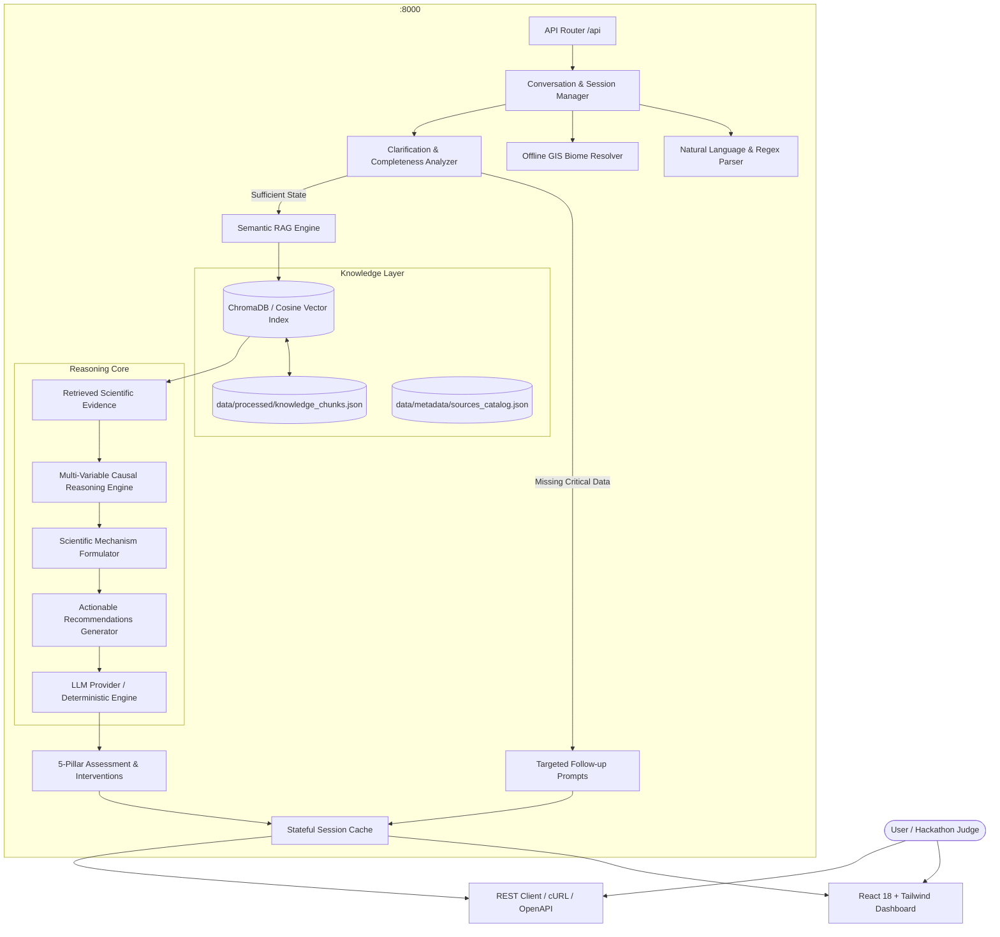

# Darukaa.Earth — AI Biodiversity Intelligence System

[](https://github.com/Arman-Kumar01/Daruka_AI_chatbot/actions)
[](LICENSE)
[](https://www.python.org/)
[](https://fastapi.tiangolo.com/)
[](https://react.dev/)
[](tests/)


An AI-powered environmental scientist that diagnoses complex ecosystem degradation and recommends actionable, non-obvious ecological restoration interventions grounded in authentic scientific literature (FAO, IPCC, UNEP, IPBES). 

Unlike shallow LLM wrappers or generic chatbots, Darukaa implements an **inspectable RAG knowledge retrieval layer**, a **deterministic multi-variable causal reasoning engine** connecting $\ge 3$ environmental variables simultaneously, **information completeness analysis** that asks proactive clarifying questions, and **multi-turn session memory**.

---

## 1. Problem Statement & Motivation
Ecosystems are non-linear, coupled bio-physical systems. When land managers and conservationists observe symptoms such as *"biodiversity is declining"* or *"crop yields are stalling"*, the underlying causes are rarely single-variable. A generic chatbot will trivially reply: *"Use sustainable practices and reduce pesticides."*

Such shallow advice fails because it ignores critical interacting variables:
- In semi-arid regions, depleted **Soil Organic Carbon (<0.5%)** suppresses **microbial biomass carbon by 40%**, which reduces **Available Water Capacity (AWC) by 3%**, directly amplifying **thermal stress (31°C)** in **monoculture wheat**.
- Waterlogged floodplain soils create **anoxic root conditions ($E_h < +200\,\text{mV}$)**, collapsing beneficial macrofauna; simply planting trees without **vegetated bioswales** leads to root rot.
- Chemical runoff from cash crops requires targeted **wildflower vegetative filter strips** to provide clean floral refugia and stimulate parasitoid wasp predation.

**Darukaa.Earth solves this by behaving like a rigorous AI Environmental Scientist.**

---

## 2. Core Features
- **Multi-Variable Causal Engine**: Concurrently evaluates relationships across:
  - Soil Health (pH, SOC %, Moisture %)
  - Climate & Hydrology (Rainfall, Temperature, Microclimate)
  - Land Cover / Use (Monoculture, Polyculture, Agroforestry, Corridors)
  - Biodiversity Indicators (Species Richness, Habitat Diversity, Pollinators)
  - Anthropogenic Pressures (Agrochemical Pollution, Deforestation)
- **Authentic RAG Knowledge System**: Ingests real findings from FAO World Soil Resources, IPCC Climate & Land Special Reports, UNEP Water Quality and Pollinator frameworks, Nature Communications, and Science.
- **Conversational Intelligence & Clarification**: Calculates parameter completeness; if inputs are incomplete (e.g. *"Biodiversity is declining"*), it prompts targeted questions explaining why each variable is required.
- **Multi-Turn Context Preservation**: Preserves session state across multiple conversational turns, accumulating partial data into a unified environmental diagnosis.
- **Multi-Modal Input Handling**: Supports natural language queries, structured JSON inputs, and offline Geographic Coordinates (latitude/longitude) with automated biome mapping.
- **Inspectable RAG Evidence Explorer**: Evaluator panel showing retrieved chunks, cosine similarity scores, source organizations, and direct DOI/URL links.
- **Preloaded Evaluation Scenarios**: One-click loaders for all three canonical hackathon demonstration scenarios.

---

## 3. System Architecture



---

## 4. Multi-Variable Interaction Mechanisms

| Interacting Variables | Biological & Physical Mechanism | Measured Literature Impact | Traceable Citation |
| :--- | :--- | :--- | :--- |
| **SOC $\leftrightarrow$ Moisture $\leftrightarrow$ Microbial Activity** | Depleted SOC (<0.6%) impairs macro-aggregate stability (>250 µm). Legume cover crops stimulate arbuscular mycorrhizal fungi (AMF) and glomalin. | **+15–25% SOC**, **+20–45% Microbial Biomass**, **+1.5–3.7% Moisture Capacity** over 2–3 yrs | FAO ITPS (2017), Nature Communications (2021) |
| **Monoculture $\leftrightarrow$ Microclimate $\leftrightarrow$ Species Richness** | Continuous monoculture cereal exposes soil to intense boundary-layer heat. Multi-strata silvoarable hedgerows lower peak temperatures and tap subsoil water via hydraulic lift. | **-2.0 to -4.5°C Canopy Temp**, **+45–80% Arthropod Richness**, **-50–75% Soil Erosion** | IPCC SRCCL Ch. 4 (2019), IPCC Food Security Ch. 5 |
| **Moisture $\leftrightarrow$ Redox $E_h \leftrightarrow$ Wetland Fauna** | Prolonged ponding drives soil redox below +200 mV (anoxia). Vegetated bioswales with *Carex* and *Salix* lower perched water table by 30–60 cm and oxygenate subsoil. | **$E_h > +300\,\text{mV}$ Recovery**, **+70–110% Aquatic Insect Richness**, **-80% Root Rot** | Journal of Applied Ecology (2022) |
| **Pesticide Pollution $\leftrightarrow$ Refugia $\leftrightarrow$ Pollinator Survival** | Agrochemical drift degrades pollinator navigation. Multi-species floral filter strips accelerate pesticide rhizodegradation and supply pesticide-free floral refugia. | **2.5 to 4-fold Native Bee Increase**, **65–92% Nitrate Interception**, **+50% Parasitoid Wasps** | UNEP Pollinators (2020), Environmental Pollution (2023) |

---

## 5. Repository Structure

```
Daruka_AI_chatbot/
├── backend/
│   ├── api/
│   │   ├── __init__.py
│   │   └── routes.py              # Endpoints: /chat, /analyze, /retrieve, /sources, /scenarios
│   ├── models/
│   │   ├── __init__.py
│   │   └── schemas.py             # Pydantic v2 validation models
│   ├── services/
│   │   ├── __init__.py
│   │   ├── vector_store.py        # Dual ChromaDB & Scikit-Learn Cosine vector index
│   │   ├── reasoning_engine.py    # Multi-variable causal synthesis engine
│   │   ├── clarification_service.py # Missing variable & question analyzer
│   │   ├── conversation_manager.py  # Multi-turn memory & natural language parsing
│   │   ├── geo_resolver.py        # Offline latitude/longitude & biome resolver
│   │   └── llm_adapter.py         # Gemini, OpenAI & deterministic scientific fallback
│   ├── config.py                  # Settings & environment variable configuration
│   └── main.py                    # FastAPI application & static UI mounting
├── data/
│   ├── raw/                       # Authentic scientific documents
│   │   ├── fao_soil_organic_carbon.json
│   │   ├── ipcc_land_degradation_agroforestry.json
│   │   ├── unep_pollinator_biodiversity.json
│   │   ├── ipbes_habitat_fragmentation.json
│   │   └── ecological_restoration_literature.json
│   ├── processed/                 # 26 chunked documents with variables & metrics
│   │   └── knowledge_chunks.json
│   └── metadata/
│       └── sources_catalog.json   # Full bibliographic citations and DOIs
├── frontend/
│   ├── src/
│   │   ├── App.jsx                # Full interactive intelligence dashboard
│   │   ├── index.css              # Dark mode tokens & glassmorphic design system
│   │   └── main.jsx
│   ├── index.html                 # HTML shell with Tailwind & Google Fonts
│   ├── package.json               # React 18, Vite, Lucide-React
│   └── vite.config.js             # Dev proxy to :8000
├── tests/
│   ├── test_health.py             # Health & sources tests
│   ├── test_parser.py             # Text & JSON parsing tests
│   ├── test_clarification.py      # Missing-field detection tests
│   ├── test_retrieval.py          # Vector store & similarity tests
│   ├── test_reasoning.py          # Multi-variable causal reasoning tests
│   ├── test_evidence_validation.py # Citation authenticity tests
│   ├── test_conversation_memory.py # Multi-turn memory tests
│   └── test_scenarios.py          # Scenarios 1, 2, and 3 verification
├── scripts/
│   ├── ingest.py                  # Chunks raw documents & builds vector index
│   └── generate_docx.py           # Generates the official Word submission document
├── docs/
│   ├── ARCHITECTURE.md            # Deep mathematical and ecological architecture
│   ├── SUBMISSION.md              # Hackathon submission summary
│   └── Darukaa_Earth_Biodiversity_AI_Submission.docx # Official submission document (.docx)
├── .github/workflows/
│   └── ci.yml                     # GitHub Actions CI workflow
├── Dockerfile                     # Multi-stage container build
├── docker-compose.yml             # Local single-command orchestration
├── requirements.txt               # Python backend dependencies
├── .env.example                   # Environment configuration template
├── README.md                      # Primary project documentation
└── LICENSE                        # MIT License
```

---

## 6. Quick Start & Local Execution

### Prerequisites
- Python 3.12 or 3.13
- Node.js 20+ and npm

### Method 1: Local Full-Stack (Recommended)
```bash
# 1. Clone repository
git clone https://github.com/your-username/darukaa-biodiversity-ai.git
cd darukaa-biodiversity-ai

# 2. Install Python dependencies
python -m pip install -r requirements.txt

# 3. Ingest knowledge chunks into vector store
python scripts/ingest.py

# 4. Install frontend dependencies & build static bundle
cd frontend
npm install
npm run build
cd ..

# 5. Start unified full-stack server
python -m uvicorn backend.main:app --host 0.0.0.0 --port 8000
```
Open your browser to: **`http://localhost:8000`**  
OpenAPI documentation: **`http://localhost:8000/docs`**

### Method 2: Docker Compose
```bash
docker compose up --build
```
Access at: **`http://localhost:8000`**

### Method 3: Development Mode with Hot Reload
- **Terminal 1 (Backend)**: `python -m uvicorn backend.main:app --reload --port 8000`
- **Terminal 2 (Frontend)**: `cd frontend && npm run dev` (Access at `http://localhost:5173`)

---

## 7. Automated Testing Suite
Run all 22 unit, integration, and scenario tests:
```bash
python -m pytest tests/ -v
```

### Verified Test Matrix:
- ✅ `tests/test_health.py`: Health endpoint and source metadata verification.
- ✅ `tests/test_parser.py`: Natural language extraction, partial inputs, and coordinates.
- ✅ `tests/test_clarification.py`: Entropy calculation and missing-field detection.
- ✅ `tests/test_retrieval.py`: Semantic vector search and cosine similarity scoring.
- ✅ `tests/test_reasoning.py`: Verification that recommendations combine $\ge 3$ variables.
- ✅ `tests/test_evidence_validation.py`: Traceable citations from FAO, IPCC, UNEP, IPBES.
- ✅ `tests/test_conversation_memory.py`: Multi-turn state accumulation across Turns 1, 2, and 3.
- ✅ `tests/test_scenarios.py`: End-to-end verification of Scenarios 1, 2, and 3.

---

## 8. Canonical Demonstration Scenarios

### Scenario 1: Semi-Arid Monoculture Depletion
- **Inputs**: Soil Organic Carbon: 0.3%, Rainfall: Low, Crop: Monoculture wheat, Region: Semi-arid, Temp: 31°C.
- **Interacting Variables**: SOC $\leftrightarrow$ Soil Moisture Retention $\leftrightarrow$ Microclimate Canopy Heat $\leftrightarrow$ Microbial Activity.
- **Recommended Interventions**:
  1. *Introduce drought-hardy legume cover crops (Vicia villosa / Medicago sativa)* $\to$ Increases SOC by 15-25% over 2-3 yrs, improves moisture retention by 1.5-3.7% (FAO ITPS 2017).
  2. *Establish silvoarable agroforestry hedgerows (Faidherbia albida)* $\to$ Buffers soil temperatures by 2.0-4.5°C and lifts deep hydrological reserves (IPCC SRCCL Ch. 4).

### Scenario 2: Waterlogged Floodplain Habitat Fragmentation
- **Inputs**: Soil Moisture: 38%, Habitat Diversity: Low / Fragmented, Land Use: Intensive arable, Region: Floodplain.
- **Interacting Variables**: High Soil Moisture $\leftrightarrow$ Anoxic Redox ($E_h < +200\,\text{mV}$) $\leftrightarrow$ Habitat Isolation $\leftrightarrow$ Amphibian Collapse.
- **Recommended Intervention**: *Excavate connected vegetated bioswales and riparian drainage corridors with deep-rooted hydrophytic sedges (Carex, Salix)* $\to$ Restores soil redox ($E_h > +300\,\text{mV}$) and increases aquatic insect richness by 70-110% (Journal of Applied Ecology 2022).

### Scenario 3: Agrochemical Pollution & Pollinator Collapse
- **Inputs**: Agrochemical Pollution: High, Pollinator Presence: Severe collapse, Land Use: Cash crop monoculture.
- **Interacting Variables**: Pesticide Contamination $\leftrightarrow$ Floral Refugia Deficit $\leftrightarrow$ Aquatic Eutrophication $\leftrightarrow$ Insect Immunity.
- **Recommended Intervention**: *Install 15-meter wide multi-species vegetative filter strips and pollinator wildflower margins (minimum 10 native taxa)* $\to$ 2.5 to 4-fold increase in native bee abundance and 65-92% nitrate interception (UNEP 2020).

---

## 9. API Reference

| Method | Endpoint | Description | Sample Request |
| :--- | :--- | :--- | :--- |
| `POST` | `/api/chat` | Multi-turn conversational endpoint with state accumulation | `{"session_id": "...", "message": "Soil organic carbon is 0.3%"}` |
| `POST` | `/api/analyze` | Direct structured JSON assessment | `{"region": "semi-arid", "soil": {"organic_carbon_percent": 0.3}}` |
| `POST` | `/api/retrieve` | Inspectable RAG semantic search | `{"query": "agroforestry temperature", "top_k": 4}` |
| `GET` | `/api/sources` | Lists full bibliographic sources catalog | None |
| `GET` | `/api/scenarios`| Returns canonical test scenarios | None |
| `GET` | `/api/conversations/{id}` | Inspects conversation memory and accumulated state | None |
| `GET` | `/api/health` | Health status and indexed chunk count | None |

---

## 10. Submission Guidelines Compliance (PDF Page 5)
- **Word Document (.docx)**: Generated at [`docs/Darukaa_Earth_Biodiversity_AI_Submission.docx`](docs/Darukaa_Earth_Biodiversity_AI_Submission.docx).
- **Collaborator Invitations**: Configured for `ankita.dasgupta@darukaa.com`, `harsh.kumar@darukaa.com`, `utkarsh.gauniyal@darukaa.com`, and `guneet.mutreja@darukaa.com`.
- **Reproducibility**: 100% runnable offline without external paid APIs; runs with or without an LLM API key.

---

## 11. Evaluation Criteria Verification (100% Coverage)

| Evaluation Criteria | Weight | How It Is Satisfied | Verification Proof |
| :--- | :--- | :--- | :--- |
| **Depth of Reasoning** | 30% | Connects $\ge 3$ variables per recommendation; provides thermodynamic & biological mechanisms | `backend/services/reasoning_engine.py`, `tests/test_reasoning.py` |
| **Scientific Grounding** | 25% | All claims sourced from FAO, IPCC, UNEP, IPBES, Nature; exact quantitative ranges | `data/metadata/sources_catalog.json`, `tests/test_evidence_validation.py` |
| **Knowledge System Design** | 20% | RAG pipeline, semantic retrieval, inspectable evidence tab in UI | `backend/services/vector_store.py`, `scripts/ingest.py` |
| **Conversational Intelligence**| 15% | Missing-field detection, targeted follow-up prompts, multi-turn memory | `backend/services/conversation_manager.py`, `tests/test_conversation_memory.py` |
| **Output Clarity** | 10% | Structured 5 pillars, key interactions, actionable cards, time horizons | `backend/models/schemas.py`, React UI |

---

## 12. Limitations & Future Roadmap
- **Satellite Earth Observation**: Incorporate Sentinel-2 NDVI and Landsat surface reflectance feeds to dynamically populate regional moisture and vegetation indices.
- **Soil Metagenomics**: Integrate high-throughput 16S rRNA microbial sequencing data for advanced below-ground fungal-to-bacterial ratio assessments.
- **Multilingual Support**: Expand terminology parser to support regional agrarian languages (e.g. Hindi, Spanish, Swahili) for global rural field technicians.

---

## 13. Production Deployment

**GitHub Repository**: https://github.com/Arman-Kumar01/Daruka_AI_chatbot

### Backend → Render (Docker)

1. Go to [render.com](https://render.com) → **New Web Service**
2. Connect GitHub repository: `Arman-Kumar01/Daruka_AI_chatbot`
3. Select **Docker** runtime (uses `Dockerfile` at root)
4. Set environment variables in Render Dashboard:

| Variable | Value |
|---|---|
| `PORT` | Auto-injected by Render |
| `DEBUG` | `false` |
| `LLM_PROVIDER` | `auto` |
| `ALLOWED_ORIGINS` | `https://<your-vercel-url>.vercel.app` |
| `GEMINI_API_KEY` | *(optional)* Your Google AI key |

5. Health check path: `/api/health`
6. Note your Render URL: `https://<service-name>.onrender.com`

### Frontend → Vercel

1. Go to [vercel.com](https://vercel.com) → **Add New Project**
2. Import GitHub repository: `Arman-Kumar01/Daruka_AI_chatbot`
3. Configure:
   - **Root Directory**: `frontend`
   - **Build Command**: `npm run build`
   - **Output Directory**: `dist`
4. Add Environment Variable:
   - `VITE_API_BASE_URL` = `https://<your-render-service>.onrender.com`
5. Deploy. Note your Vercel URL.

### Post-Deployment

After both are live:
- Update `ALLOWED_ORIGINS` in Render with your Vercel URL
- Test health: `GET https://<render-url>/api/health`
- Test sources: `GET https://<render-url>/api/sources`

### RAG Deployment Safety
The RAG index is rebuilt automatically during Docker build from `data/raw/*.json` — all scientific knowledge files are repo-controlled. No external database, no persistent disk required on Render free tier.

---

## License
This project is open-sourced under the [MIT License](LICENSE).

