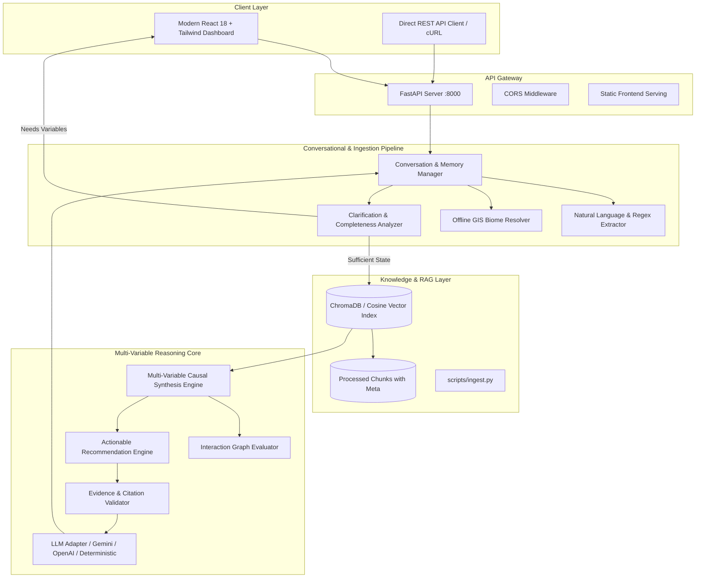

# Architecture Specification: Darukaa.Earth AI Biodiversity Intelligence Platform

## Overview
Darukaa.Earth is an AI environmental scientist that moves beyond shallow LLM prompting by combining:
1. **Curated Authoritative Knowledge**: Peer-reviewed agro-ecological literature, FAO World Soil reports, IPCC Special Reports on Climate Change and Land, UNEP frameworks, and IPBES global assessments.
2. **Multi-Variable Causal Engine**: Rigorous reasoning that simultaneously models relationships across $\ge 3$ environmental variables.
3. **Conversational Information Completeness**: Information entropy checks that detect missing parameters and ask targeted clarifying questions.
4. **State Accumulation Memory**: Multi-turn session memory that retains and aggregates partial inputs.
5. **Inspectable RAG Architecture**: Complete traceability with similarity scoring, DOI/URL links, and organization metadata.

---

## High-Level System Architecture

---

## Core Scientific Pillars Covered
1. **Soil Health**: Soil Organic Carbon (SOC %), pH, Volumetric Moisture %, Bulk Density, Cation Exchange Capacity, Earthworm abundance.
2. **Climate & Hydrology**: Rainfall patterns, temperature extremes, microclimate moderation, evapotranspiration.
3. **Land Use / Land Cover**: Monoculture vs diversified agroforestry, silvopasture, cover crop rotations, vegetative buffers.
4. **Biodiversity Indicators**: Species richness, Simpson/Shannon diversity, pollinator visitation duration, below-ground fungal-to-bacterial biomass ratios.
5. **Human Pressures**: Chemical pesticide runoff, synthetic fertilizer eutrophication, heavy metal residues, habitat fragmentation edge effects.

---

## Multi-Variable Causal Formulas & Mechanisms
Unlike generic chatbots that recommend "use sustainable farming", Darukaa models specific thermodynamic and biological interactions:

### 1. Soil Organic Carbon $\leftrightarrow$ Hydraulic Retention $\leftrightarrow$ Microbial Survival
$$\Delta \text{AWC} \approx 1.5\% - 3.7\% \times \Delta \text{SOC}_{0.5\%}$$
$$\text{AMF Hyphal Density} \xrightarrow{+62\%} \text{Glomalin Production} \to \text{Macro-aggregates} > 250\,\mu\text{m}$$
*Mechanism*: Introduction of *Vicia villosa* and *Medicago sativa* stimulates rhizosphere exudates that increase microbial biomass carbon by 20-45%, building macro-aggregates that retain critical moisture in low-rainfall semi-arid environments.

### 2. Multi-Strata Agroforestry $\leftrightarrow$ Canopy Temperature $\leftrightarrow$ Biodiversity
$$\Delta T_{\text{canopy}} = -2.0^\circ\text{C to } -4.5^\circ\text{C}$$
*Mechanism*: Faidherbia albida and Acacia hedgerows lower peak boundary layer heat, buffer wind shear by 50-75%, and lift subsoil water into the epipedon via hydraulic lift, sustaining arthropod species richness (+45-80% according to IPCC SRCCL Chapter 4).

### 3. Vegetated Bioswales $\leftrightarrow$ Soil Redox $\leftrightarrow$ Wetland Colonization
$$\text{Redox Potential } E_h > +300\,\text{mV} \quad (\text{Recovery from anoxic } < +200\,\text{mV})$$
*Mechanism*: Hydrophytic deep roots (*Carex*, *Salix*, *Alnus*) introduce oxygen into saturated matrices via aerenchyma tissues, lowering the perched water table by 30-60 cm within 48 hours and boosting aquatic insect and amphibian richness by 70-110%.
